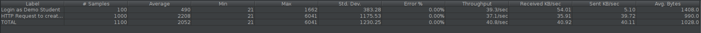
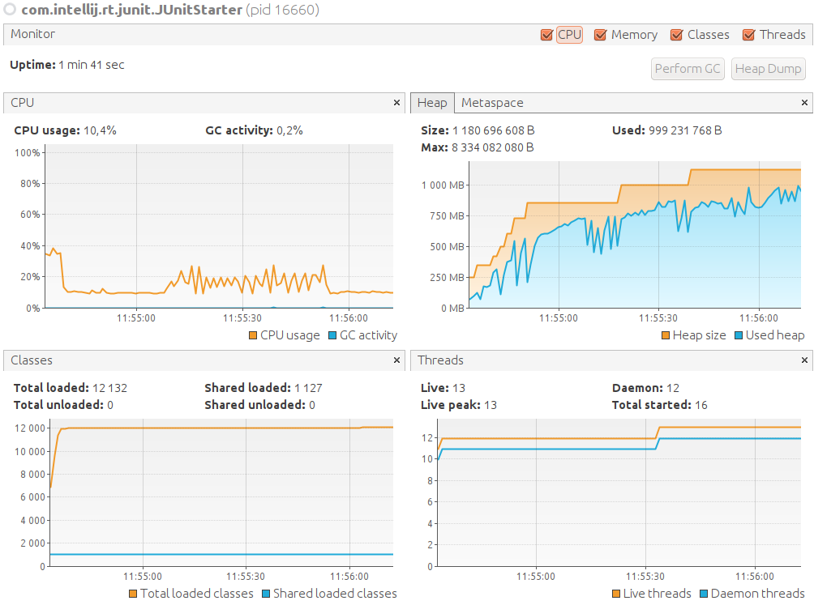

# ES20 P2 submission, Group 14

---

## Feature DDP

### Subgroup
 - José Miguel Gomes, ist189490, josemiguelpg
   + Issues assigned: [#104](https://github.com/tecnico-softeng/es20al_14-project/issues/104), [#107](https://github.com/tecnico-softeng/es20al_14-project/issues/107), [#132](https://github.com/tecnico-softeng/es20al_14-project/issues/132), [#134](https://github.com/tecnico-softeng/es20al_14-project/issues/134), [#135](https://github.com/tecnico-softeng/es20al_14-project/issues/135), [#137](https://github.com/tecnico-softeng/es20al_14-project/issues/137), [#138](https://github.com/tecnico-softeng/es20al_14-project/issues/138), [#144](https://github.com/tecnico-softeng/es20al_14-project/issues/144)
 - Telmo Lopes, ist189540, TheZeOmlet
   + Issues assigned: [#109](https://github.com/tecnico-softeng/es20al_14-project/issues/109), [#111](https://github.com/tecnico-softeng/es20al_14-project/issues/111), [#128](https://github.com/tecnico-softeng/es20al_14-project/issues/128), [#129](https://github.com/tecnico-softeng/es20al_14-project/issues/129)
 
### Pull requests associated with this feature

The list of pull requests associated with this feature is:

 - [PR #145](https://github.com/tecnico-softeng/es20al_14-project/pull/145)
 - [PR #169](https://github.com/tecnico-softeng/es20al_14-project/pull/169)
 - [PR #174](https://github.com/tecnico-softeng/es20al_14-project/pull/174)

### Web services definition

#### Controllers
 - [createDiscussion](https://github.com/tecnico-softeng/es20al_14-project/blob/c30322785ffd6de7f3628e76524738c125980a34/backend/src/main/java/pt/ulisboa/tecnico/socialsoftware/tutor/discussion/DiscussionController.java#L32)
 - [teacherAnswersStudent](https://github.com/tecnico-softeng/es20al_14-project/blob/c30322785ffd6de7f3628e76524738c125980a34/backend/src/main/java/pt/ulisboa/tecnico/socialsoftware/tutor/discussion/DiscussionController.java#L38)
 - [getDiscussionsStudent](https://github.com/tecnico-softeng/es20al_14-project/blob/c30322785ffd6de7f3628e76524738c125980a34/backend/src/main/java/pt/ulisboa/tecnico/socialsoftware/tutor/discussion/DiscussionController.java#L44)

### Feature testing

Each subgroup member defined one reading test and one writing test. The direct links to these are:

 - [CreateDiscussionTest](https://github.com/tecnico-softeng/es20al_14-project/blob/develop/backend/jmeter/discussion/CreateDiscussionTest.jmx)
 - [WSTeacherAnswersStudentTest](https://github.com/tecnico-softeng/es20al_14-project/blob/develop/backend/jmeter/discussion/WSTeacherAnswersStudentTest.jmx)
 - [WSGetStudentDiscussions](https://github.com/tecnico-softeng/es20al_14-project/blob/develop/backend/jmeter/discussion/WSGetStudentDiscussions.jmx)

#### Screenshots of Results Trees and DB cleanup

  - Create Discussion Test (CreateDiscussionTest)

  - Teacher Answers Student Test (WSTeacherAnswersStudentTest)

  - Get Student's Discussions (WSGetStudentDiscussions)

### Load testing

Each subgroup member defined one reading test and one writing test. The direct links to these are:

 - [CreateDiscussionLoadTest](https://github.com/tecnico-softeng/es20al_14-project/blob/develop/backend/jmeter/discussion/CreateDiscussionLoadTest.jmx)
 - [WSTeacherAnswersStudentLoadTest](https://github.com/tecnico-softeng/es20al_14-project/blob/develop/backend/jmeter/discussion/WSTeacherAnswersStudentLoadTest.jmx)
 - [WSGetStudentDiscussionsLoadTest](https://github.com/tecnico-softeng/es20al_14-project/blob/develop/backend/jmeter/discussion/WSGetStudentDiscussionsLoadTest.jmx)

#### Screenshots of Summary Reports and DB cleanup

  - Create Discussion Load Test (CreateDiscussionLoadTest)

  - Teacher Answers Student Load Test (WSTeacherAnswersStudentLoadTest)

  - Get Student's Discussions Load Test (WSGetStudentDiscussionsLoadTest)

### Service profiling

We used the [Async Profiler](https://www.jetbrains.com/help/idea/async-profiler.html).

#### Screenshots of summary reports

  - Create Discussion Test (CreateDiscussionTest)

  - Teacher Answers Student Test (WSTeacherAnswersStudentTest)

  - Get Student's Discussions (WSGetStudentDiscussions)

#### Discussion of findings

- When creating the discussion, the cpu spends most of its resources verifying the checkDuplicates condition.
- When writing the answer from the teacher, the method itself is not one of the methods that consumes most of the cpu.
- When getting the students discussions, the method itself is not one of the methods that consumes most of the cpu.

Improvements: 
- to look for the user that creates/answers the discussion, we used to search with findByUsername and this was a costly operation. Now, we look through findById (we added an userId attribute in DiscussionDto class).
- to find if a user had answered to a question we used to look to all the entities that make the connection between those too and this was a costly query in the database. Now we get the questionAnswerId from the front-end and have a more efficient query.

---

## Feature TDP

### Subgroup
 - Alexandre Duarte, 89403, alexduarte23
   + Issues assigned: [#97](https://github.com/tecnico-softeng/es20al_14-project/issues/97), [#99](https://github.com/tecnico-softeng/es20al_14-project/issues/99), [#106](https://github.com/tecnico-softeng/es20al_14-project/issues/106), [#108](https://github.com/tecnico-softeng/es20al_14-project/issues/108), [#123](https://github.com/tecnico-softeng/es20al_14-project/issues/123), [#124](https://github.com/tecnico-softeng/es20al_14-project/issues/124), [#125](https://github.com/tecnico-softeng/es20al_14-project/issues/125), [#148](https://github.com/tecnico-softeng/es20al_14-project/issues/148), [#149](https://github.com/tecnico-softeng/es20al_14-project/issues/149), [#150](https://github.com/tecnico-softeng/es20al_14-project/issues/150)
 - Daniel Lopes, 89426, DFL13
   + Issues assigned: [#98](https://github.com/tecnico-softeng/es20al_14-project/issues/98), [#100](https://github.com/tecnico-softeng/es20al_14-project/issues/100), [#105](https://github.com/tecnico-softeng/es20al_14-project/issues/105), [#110](https://github.com/tecnico-softeng/es20al_14-project/issues/110), [#126](https://github.com/tecnico-softeng/es20al_14-project/issues/126) 
 
### Pull requests associated with this feature

The list of pull requests associated with this feature is:

 - [PR #172 - List](https://github.com/tecnico-softeng/es20al_14-project/pull/172)
 - [PR #143 - Create](https://github.com/tecnico-softeng/es20al_14-project/pull/143)
 - [PR #131 - Enroll](https://github.com/tecnico-softeng/es20al_14-project/pull/131)

### Web services definition

#### Controllers
 - [List](https://github.com/tecnico-softeng/es20al_14-project/blob/bfb64341a0287b1450923db8b9db3cb21826120e/backend/src/main/java/pt/ulisboa/tecnico/socialsoftware/tutor/tournament/TournamentController.java#L52)
 - [Create](https://github.com/tecnico-softeng/es20al_14-project/blob/bfb64341a0287b1450923db8b9db3cb21826120e/backend/src/main/java/pt/ulisboa/tecnico/socialsoftware/tutor/tournament/TournamentController.java#L39)
 - [Enroll](https://github.com/tecnico-softeng/es20al_14-project/blob/bfb64341a0287b1450923db8b9db3cb21826120e/backend/src/main/java/pt/ulisboa/tecnico/socialsoftware/tutor/tournament/TournamentController.java#L26)

### Feature testing

Each subgroup member defined one reading test and one writing test. The direct links to these are:

 - [ReadingTestJMeter - List](https://github.com/tecnico-softeng/es20al_14-project/blob/bfb64341a0287b1450923db8b9db3cb21826120e/backend/jmeter/tournament/WSGetOpenTournamentsTest.jmx)
 - [WritingTestJMeter0 - Create](https://github.com/tecnico-softeng/es20al_14-project/blob/bfb64341a0287b1450923db8b9db3cb21826120e/backend/jmeter/tournament/WSCreateTournamentTest.jmx)
 - [WritingTestJMeter1 - Enroll](https://github.com/tecnico-softeng/es20al_14-project/blob/bfb64341a0287b1450923db8b9db3cb21826120e/backend/jmeter/tournament/WSEnrollStudenInTournamentTest.jmx)

#### Screenshots of Results Trees and DB cleanup

  - List Open Tournaments (ReadingTest)

  - Create Tournament (WritingTest0)

  - Student Enroll (WritingTest1)

### Load testing

Each subgroup member defined one reading test and one writing test. The direct links to these are:

- [ReadingTestJMeter - List](https://github.com/tecnico-softeng/es20al_14-project/blob/bfb64341a0287b1450923db8b9db3cb21826120e/backend/jmeter/tournament/WSGetOpenTournamentsLoadTest.jmx)
 - [WritingTestJMeter0 - Create](https://github.com/tecnico-softeng/es20al_14-project/blob/bfb64341a0287b1450923db8b9db3cb21826120e/backend/jmeter/tournament/WSCreateTournamentLoadTest.jmx)
 - [WritingTestJMeter1 - Enroll](https://github.com/tecnico-softeng/es20al_14-project/blob/bfb64341a0287b1450923db8b9db3cb21826120e/backend/jmeter/tournament/WSEnrollStudenInTournamentLoadTest.jmx)

#### Screenshots of Summary Reports and DB cleanup

  - List Open Tournaments (ReadingTest)

  - Create Tournament (WritingTest0)

  - Student Enroll (WritingTest1)

### Service profiling

We used the [Async Profiler](https://www.jetbrains.com/help/idea/async-profiler.html).

#### Screenshots of summary reports

  - List Open Tournaments (ReadingTest)

  - Create Tournament (WritingTest0)

  - Student Enroll (WritingTest1)

#### Discussion of findings

  - When creating a tournament, the cpu spends most of its resources saving the created tournament in the database (using the persist operation).
  - When getting the list of open tournaments, most of the resources are spent in the generation of tournamentDto's (mainly on date-time formatting operations) and secondarily in the sorting of the resulting list.
  - When enrolling the student, most of the resources are spent getting the user and tournament by id and formatting the date to a string on the Dto.
---
  - **Improvement :** in createTournament service restructured some attributes' validation, now validation is done at the moment od insertion instead of before the tournament object creation, preventing unnecessary findbyid calls ([solved](https://github.com/tecnico-softeng/es20al_14-project/commit/abfd024e579467d4f65018225273b4edeb085da6))
  -  **Improvement :** found unnecessary set contains call for checking if student was already enrolled in the tournament, that check could be done by checking the return value of the set add call ([solved](https://github.com/tecnico-softeng/es20al_14-project/pull/131/commits/5c1114f474bde746906588db19d0383b2fb30ad7))

