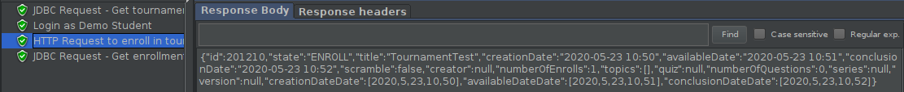
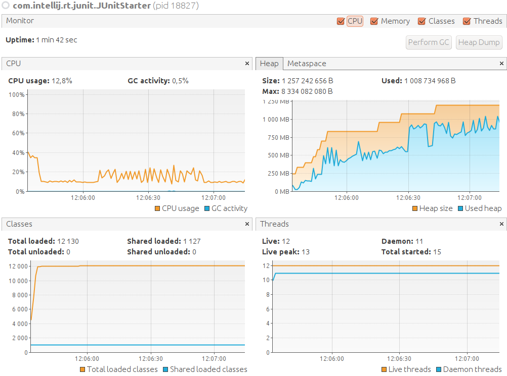

# ES20 P2 submission, Group 14

## Feature TDP

### Subgroup
 - Alexandre Duarte, 89403, alexduarte23
   + Issues assigned: [#97](https://github.com/tecnico-softeng/es20al_14-project/issues/97), [#99](https://github.com/tecnico-softeng/es20al_14-project/issues/99), [#106](https://github.com/tecnico-softeng/es20al_14-project/issues/106), [#108](https://github.com/tecnico-softeng/es20al_14-project/issues/108), [#123](https://github.com/tecnico-softeng/es20al_14-project/issues/123), [#124](https://github.com/tecnico-softeng/es20al_14-project/issues/124), [#125](https://github.com/tecnico-softeng/es20al_14-project/issues/125), [#148](https://github.com/tecnico-softeng/es20al_14-project/issues/148), [#149](https://github.com/tecnico-softeng/es20al_14-project/issues/149), [#150](https://github.com/tecnico-softeng/es20al_14-project/issues/150)
 - Daniel Lopes, 89426, DFL13
   + Issues assigned: [#98](https://github.com/tecnico-softeng/es20al_14-project/issues/98), [#100](https://github.com/tecnico-softeng/es20al_14-project/issues/100), [#105](https://github.com/tecnico-softeng/es20al_14-project/issues/105), [#110](https://github.com/tecnico-softeng/es20al_14-project/issues/110), [#126](https://github.com/tecnico-softeng/es20al_14-project/issues/126) 
 
### Pull requests associated with this feature

The list of pull requests associated with this feature is:

 - [PR #000](https://github.com/tecnico-softeng/es20al_14-project/pull/143)
 - [PR #001](https://github.com/tecnico-softeng/es20al_14-project/pull/172)
 - [PR #002](https://github.com/tecnico-softeng/es20al_14-project/pull/131)

### Web services definition

#### Controllers
 - [Controller0](https://github.com) **TODO**
 - [Controller1](https://github.com) **TODO**
 - [Controller2](https://github.com) **TODO**

### Feature testing

Each subgroup member defined one reading test and one writing test. The direct links to these are:

 - [ReadingTestJMeter](https://github.com) **TODO**
 - [WritingTestJMeter0](https://github.com) **TODO**
 - [WritingTestJMeter1](https://github.com) **TODO**

#### Screenshots of Results Trees and DB cleanup

  - List Open Tournaments (ReadingTest)

  - Create Tournament (WritingTest0)

  - Student Enroll (WritingTest1)

### Load testing

Each subgroup member defined one reading test and one writing test. The direct links to these are:

 - [ReadingTestJMeter](https://github.com) **TODO**
 - [WritingTestJMeter0](https://github.com) **TODO**
 - [WritingTestJMeter1](https://github.com) **TODO**

#### Screenshots of Summary Reports and DB cleanup

  - List Open Tournaments (ReadingTest)

  - Create Tournament (WritingTest0)

  - Student Enroll (WritingTest1)

### Service profiling

We used the [Async Profiler](https://www.jetbrains.com/help/idea/async-profiler.html).

#### Screenshots of summary reports

  - List Open Tournaments (ReadingTest)

  - Create Tournament (WritingTest0)

  - Student Enroll (WritingTest1)

#### Discussion of findings

  - When creating a tournament, the cpu spends most of its resources saving the created tournament in the database (using the persist operation).
  - When getting the list of open tournaments, most of the resources are spent in the generation of tournamentDto's (mainly on date-time formatting operations) and secondarily in the sorting of the resulting list.
  - When enrolling the student, most of the resources are spent getting the user and tournament by id and formatting the date to a string on the Dto.
---
  - **Improvement :** in createTournament service restructured some attributes' validation, now validation is done at the moment od insertion instead of before the tournament object creation, preventing unnecessary findbyid calls ([solved](https://github.com/tecnico-softeng/es20al_14-project/commit/abfd024e579467d4f65018225273b4edeb085da6))
  -  **Improvement :** found unnecessary set contains call for checking if student was already enrolled in the tournament, that check could be done by checking the return value of the set add call ([solved](https://github.com/tecnico-softeng/es20al_14-project/pull/131/commits/5c1114f474bde746906588db19d0383b2fb30ad7))