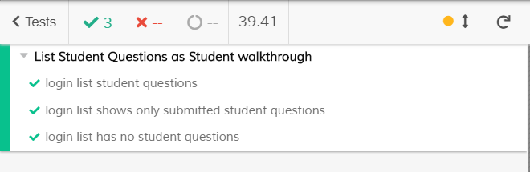
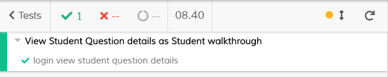
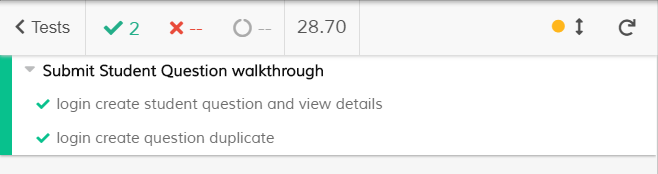
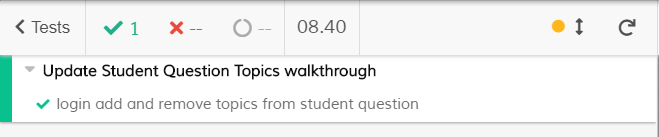
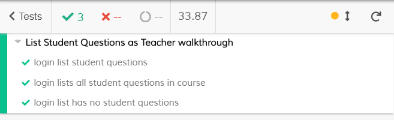
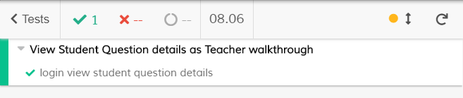
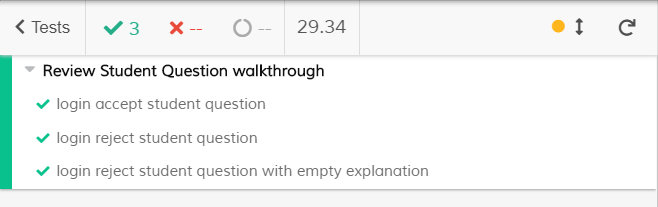
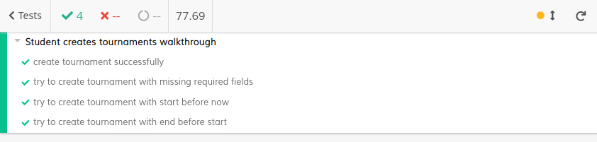
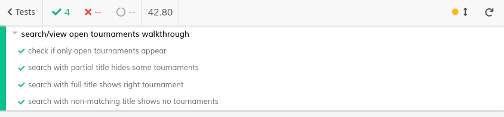
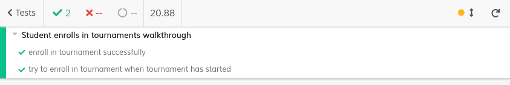

# ES20 P3 submission, Group 14

## Feature PPA

### Subgroup

 - João Miguel Do Ó Matos Soares, 89475, gh-jsoares
   + Issues assigned: [#211](https://github.com/tecnico-softeng/es20al_14-project/issues/211), [#212](https://github.com/tecnico-softeng/es20al_14-project/issues/212), [#213](https://github.com/tecnico-softeng/es20al_14-project/issues/213), [#214](https://github.com/tecnico-softeng/es20al_14-project/issues/214), [#215](https://github.com/tecnico-softeng/es20al_14-project/issues/215), [#216](https://github.com/tecnico-softeng/es20al_14-project/issues/216), [#217](https://github.com/tecnico-softeng/es20al_14-project/issues/217), [#218](https://github.com/tecnico-softeng/es20al_14-project/issues/218), [#219](https://github.com/tecnico-softeng/es20al_14-project/issues/219), [#220](https://github.com/tecnico-softeng/es20al_14-project/issues/220), [#221](https://github.com/tecnico-softeng/es20al_14-project/issues/221), [#222](https://github.com/tecnico-softeng/es20al_14-project/issues/222), [#223](https://github.com/tecnico-softeng/es20al_14-project/issues/223), [#224](https://github.com/tecnico-softeng/es20al_14-project/issues/224), [#225](https://github.com/tecnico-softeng/es20al_14-project/issues/225), [#226](https://github.com/tecnico-softeng/es20al_14-project/issues/226), [#227](https://github.com/tecnico-softeng/es20al_14-project/issues/227), [#228](https://github.com/tecnico-softeng/es20al_14-project/issues/228), [#229](https://github.com/tecnico-softeng/es20al_14-project/issues/229), [#230](https://github.com/tecnico-softeng/es20al_14-project/issues/230), [#231](https://github.com/tecnico-softeng/es20al_14-project/issues/231), [#232](https://github.com/tecnico-softeng/es20al_14-project/issues/232), [#233](https://github.com/tecnico-softeng/es20al_14-project/issues/233), [#234](https://github.com/tecnico-softeng/es20al_14-project/issues/234)
 - Luís António Lopes Cardoso, 89493, LuisAntonioCardoso
   + Issues assigned:
 
### Pull requests associated with this feature

The list of pull requests associated with this feature is:

 - [PR #248](https://github.com/tecnico-softeng/es20al_14-project/pull/248)
 - [PR #256](https://github.com/tecnico-softeng/es20al_14-project/pull/256)
 - [PR #240](https://github.com/tecnico-softeng/es20al_14-project/pull/240)

### Frontend

#### New/Updated Views

 - **Student (new)**
   - [StudentQuestionsView](https://github.com/tecnico-softeng/es20al_14-project/blob/PpA-P3/frontend/src/views/student/questions/StudentQuestionsView.vue)
   - [EditStudentQuestionTopics](https://github.com/tecnico-softeng/es20al_14-project/blob/PpA-P3/frontend/src/views/student/questions/EditStudentQuestionTopics.vue)
   - [EditStudentQuestionDialog](https://github.com/tecnico-softeng/es20al_14-project/blob/PpA-P3/frontend/src/views/student/questions/EditStudentQuestionDialog.vue)
 
 - **Teacher (new)**
   - [StudentQuestionsView](https://github.com/tecnico-softeng/es20al_14-project/blob/PpA-P3/frontend/src/views/teacher/questions/student/StudentQuestionsView.vue)
   - [RejectStudentQuestionsDialog](https://github.com/tecnico-softeng/es20al_14-project/blob/PpA-P3/frontend/src/views/teacher/questions/student/RejectStudentQuestionsDialog.vue)

 - **Shared (new)**
   - [ShowStudentQuestionDialog](https://github.com/tecnico-softeng/es20al_14-project/blob/PpA-P3/frontend/src/views/student/questions/ShowStudentQuestionDialog.vue)
   - [ShowStudentQuestion](https://github.com/tecnico-softeng/es20al_14-project/blob/PpA-P3/frontend/src/views/student/questions/ShowStudentQuestion.vue)

#### New/Updated Models

 - [StudentQuestion](https://github.com/tecnico-softeng/es20al_14-project/blob/PpA-P3/frontend/src/models/management/StudentQuestion.ts)

### Additional services implemented

 - _None_

### End-to-end tests

To run these tests firstly you need to copy the file `cypress.env.json.example` and rename it to `cypress.env.json` and then you need to change the values inside this file to the ones of your database. 

`Note: User needs to have a password in the database in order to work properly`

#### Created tests

 - **Student**
   - [List Submitted](https://github.com/tecnico-softeng/es20al_14-project/blob/PpA-P3/frontend/tests/e2e/specs/questions/student/listAsStudent.js)
     - [Login list student questions](https://github.com/tecnico-softeng/es20al_14-project/blob/PpA-P3/frontend/tests/e2e/specs/questions/student/listAsStudent.js#L12)
	 - [Login list shows only submitted student questions](https://github.com/tecnico-softeng/es20al_14-project/blob/PpA-P3/frontend/tests/e2e/specs/questions/student/listAsStudent.js#L21)
	 - [Login list has no student questions](https://github.com/tecnico-softeng/es20al_14-project/blob/PpA-P3/frontend/tests/e2e/specs/questions/student/listAsStudent.js#L30)

   - [View Details](https://github.com/tecnico-softeng/es20al_14-project/blob/PpA-P3/frontend/tests/e2e/specs/questions/student/viewAsStudent.js)
     - [Login view student question details](https://github.com/tecnico-softeng/es20al_14-project/blob/PpA-P3/frontend/tests/e2e/specs/questions/student/viewAsStudent.js#L16)

   - [Submit New](https://github.com/tecnico-softeng/es20al_14-project/blob/PpA-P3/frontend/tests/e2e/specs/questions/student/submitStudentQuestion.js)
     - [Login create student question and view details](https://github.com/tecnico-softeng/es20al_14-project/blob/PpA-P3/frontend/tests/e2e/specs/questions/student/submitStudentQuestion.js#L13)
     - [Login create question duplicate](https://github.com/tecnico-softeng/es20al_14-project/blob/PpA-P3/frontend/tests/e2e/specs/questions/student/submitStudentQuestion.js#L21)
   
   - [Update Topics](https://github.com/tecnico-softeng/es20al_14-project/blob/PpA-P3/frontend/tests/e2e/specs/questions/student/updateStudentQuestionTopics.js)
     - [Login add and remove topics from student question](https://github.com/tecnico-softeng/es20al_14-project/blob/PpA-P3/frontend/tests/e2e/specs/questions/student/updateStudentQuestionTopics.js#L14)

 - **Teacher**
   - [List Submitted](https://github.com/tecnico-softeng/es20al_14-project/blob/PpA-P3/frontend/tests/e2e/specs/questions/student/listAsTeacher.js)
     - [Login list student questions](https://github.com/tecnico-softeng/es20al_14-project/blob/PpA-P3/frontend/tests/e2e/specs/questions/student/listAsTeacher.js#L12)
	 - [Login lists all student questions in course](https://github.com/tecnico-softeng/es20al_14-project/blob/PpA-P3/frontend/tests/e2e/specs/questions/student/listAsTeacher.js#L21)
	 - [Login list has no student questions](https://github.com/tecnico-softeng/es20al_14-project/blob/PpA-P3/frontend/tests/e2e/specs/questions/student/listAsTeacher.js#L30)

   - [View Details](https://github.com/tecnico-softeng/es20al_14-project/blob/PpA-P3/frontend/tests/e2e/specs/questions/student/viewAsTeacher.js)
     - [Login view student question details](https://github.com/tecnico-softeng/es20al_14-project/blob/PpA-P3/frontend/tests/e2e/specs/questions/student/viewAsTeacher.js#L16)
 
   - [Review](https://github.com/tecnico-softeng/es20al_14-project/blob/PpA-P3/frontend/tests/e2e/specs/questions/student/reviewStudentQuestion.js)
     - [Login accept student question](https://github.com/tecnico-softeng/es20al_14-project/blob/PpA-P3/frontend/tests/e2e/specs/questions/student/reviewStudentQuestion.js#L16)
	 - [Login reject student question](https://github.com/tecnico-softeng/es20al_14-project/blob/PpA-P3/frontend/tests/e2e/specs/questions/student/reviewStudentQuestion.js#L23)
	 - [Login reject student question with empty explanation](https://github.com/tecnico-softeng/es20al_14-project/blob/PpA-P3/frontend/tests/e2e/specs/questions/student/reviewStudentQuestion.js#L35)

#### Rationale
Both the *List Submitted* and *View Details* tests, from the student and the teacher, verify that the UI works accordingly: lists submitted questions (with permission to view them), and view more details (such as options).
The *Submit New* and *Update Topics* tests verify that the student can navigate the UI to submit valid student questions, checking for a duplicate title, and to add and remove topics to the submitted question.
The "Review* tests verify that the teacher can accept and reject listed student questions, given that he provides an explanation in case of the latter.

#### Commands defined

 - [commands.js](https://github.com/tecnico-softeng/es20al_14-project/blob/PpA-P3/frontend/tests/e2e/support/commands.js)
   - General access commands
 - [database.js](https://github.com/tecnico-softeng/es20al_14-project/blob/PpA-P3/frontend/tests/e2e/support/database.js)
   - Database access commands
 - [questions/student/commands.js](https://github.com/tecnico-softeng/es20al_14-project/blob/PpA-P3/frontend/tests/e2e/support/questions/student/commands.js)
   - Import the other commands
   - Holds general module commands
 - [questions/student/dbCommands.js](https://github.com/tecnico-softeng/es20al_14-project/blob/PpA-P3/frontend/tests/e2e/support/questions/student/dbCommands.js)
   - Module specific database commands: init and cleanup
 - [questions/student/assertCommands.js](https://github.com/tecnico-softeng/es20al_14-project/blob/PpA-P3/frontend/tests/e2e/support/questions/student/assertCommands.js)
   - Module specific assert commands
 - [questions/student/studentCommands.js](https://github.com/tecnico-softeng/es20al_14-project/blob/PpA-P3/frontend/tests/e2e/support/questions/student/studentCommands.js)
   - Student specific commands
 - [questions/student/teacherCommands.js](https://github.com/tecnico-softeng/es20al_14-project/blob/PpA-P3/frontend/tests/e2e/support/questions/student/teacherCommands.js)
   - Teacher specific commands
 
#### Screenshot of test results overview

##### Student:

##### Teacher:
  
  
  

---

## Feature TDP

### Subgroup

 - Alexandre Duarte, 89403, alexduarte23
   + Issues assigned: [#196](https://github.com/tecnico-softeng/es20al_14-project/issues/196), [#197](https://github.com/tecnico-softeng/es20al_14-project/issues/197), [#205](https://github.com/tecnico-softeng/es20al_14-project/issues/205), [#198](https://github.com/tecnico-softeng/es20al_14-project/issues/198), [#191](https://github.com/tecnico-softeng/es20al_14-project/issues/191), [#235](https://github.com/tecnico-softeng/es20al_14-project/issues/235), [#190](https://github.com/tecnico-softeng/es20al_14-project/issues/190)
 - Daniel Lopes, 89426, DFL13
   + Issues assigned: [#189](https://github.com/tecnico-softeng/es20al_14-project/issues/189), [#190](https://github.com/tecnico-softeng/es20al_14-project/issues/190), [#195](https://github.com/tecnico-softeng/es20al_14-project/issues/195), [#199](https://github.com/tecnico-softeng/es20al_14-project/issues/199), [#200](https://github.com/tecnico-softeng/es20al_14-project/issues/200), [#242](https://github.com/tecnico-softeng/es20al_14-project/issues/242), [#188](https://github.com/tecnico-softeng/es20al_14-project/issues/188)
 
### Pull requests associated with this feature

The list of pull requests associated with this feature is:

 - [PR #237 - open](https://github.com/tecnico-softeng/es20al_14-project/pull/237)
 - [PR #243 - create](https://github.com/tecnico-softeng/es20al_14-project/pull/243)
 - [PR #253 - enroll](https://github.com/tecnico-softeng/es20al_14-project/pull/253)

### Frontend

#### New/Updated Views

 - [open/enroll View](https://github.com/tecnico-softeng/es20al_14-project/blob/230fe0796bd8c6000b40653c0bad3f6cdc160380/frontend/src/views/student/tournament/OpenTournamentsView.vue)
 - [create View](https://github.com/tecnico-softeng/es20al_14-project/blob/230fe0796bd8c6000b40653c0bad3f6cdc160380/frontend/src/views/student/tournament/CreateTournamentView.vue)

#### New/Updated Models

 - [Tournament Model](https://github.com/tecnico-softeng/es20al_14-project/blob/230fe0796bd8c6000b40653c0bad3f6cdc160380/frontend/src/models/management/Tournament.ts)

### Additional services implemented

 (none)

### End-to-end tests

To run these tests firstly you need to copy the file `cypress.env.json.example` and rename it to `cypress.env.json` and then you need to change the values inside this file to the ones of your database. 

`Note: User needs to have a password in the database in order to work properly`

#### Created tests

 - Create:
   - [Create tournament successfully](https://github.com/tecnico-softeng/es20al_14-project/blob/230fe0796bd8c6000b40653c0bad3f6cdc160380/frontend/tests/e2e/specs/tournament/createTournamentTest.js#L17)
   - [Try to create tournament with missing required fields](https://github.com/tecnico-softeng/es20al_14-project/blob/230fe0796bd8c6000b40653c0bad3f6cdc160380/frontend/tests/e2e/specs/tournament/createTournamentTest.js#L25)
   - [Try to create tournament with start before now](https://github.com/tecnico-softeng/es20al_14-project/blob/230fe0796bd8c6000b40653c0bad3f6cdc160380/frontend/tests/e2e/specs/tournament/createTournamentTest.js#L33)
   - [Try to create tournament with end before start](https://github.com/tecnico-softeng/es20al_14-project/blob/230fe0796bd8c6000b40653c0bad3f6cdc160380/frontend/tests/e2e/specs/tournament/createTournamentTest.js#L41)
 - Open:
   - [Check if only open tournaments appear](https://github.com/tecnico-softeng/es20al_14-project/blob/230fe0796bd8c6000b40653c0bad3f6cdc160380/frontend/tests/e2e/specs/tournament/openTournamentsTest.js#L25)
   - [Search with partial title hides some tournaments](https://github.com/tecnico-softeng/es20al_14-project/blob/230fe0796bd8c6000b40653c0bad3f6cdc160380/frontend/tests/e2e/specs/tournament/openTournamentsTest.js#L35)
   - [Search with full title shows right tournament](https://github.com/tecnico-softeng/es20al_14-project/blob/230fe0796bd8c6000b40653c0bad3f6cdc160380/frontend/tests/e2e/specs/tournament/openTournamentsTest.js#L45)
   - [Search with non-matching title shows no tournaments](https://github.com/tecnico-softeng/es20al_14-project/blob/230fe0796bd8c6000b40653c0bad3f6cdc160380/frontend/tests/e2e/specs/tournament/openTournamentsTest.js#L55)
 - Enroll:
   - [Enroll in tournament successfully](https://github.com/tecnico-softeng/es20al_14-project/blob/230fe0796bd8c6000b40653c0bad3f6cdc160380/frontend/tests/e2e/specs/tournament/enrollTournament.js#L24)
   - [Try to enroll in tournament when tournament has started](https://github.com/tecnico-softeng/es20al_14-project/blob/230fe0796bd8c6000b40653c0bad3f6cdc160380/frontend/tests/e2e/specs/tournament/enrollTournament.js#L32)

#### Rationale
 - Create tournament: The chosen tests confirm the student can successfully create tournaments and that the users are given correct alerts regarding invalid input and successful creation.

 - Open tournaments: The tests verify that only open tournaments are shown to the users and when using the search bar the expected outcome is encountered.

 - Tournament enroll: Confirms the students can successfully enroll and are not given permition to reenroll again on the same tournament or to enroll in the ones already started.

#### Commands defined

 - [commands.js (group shared)](https://github.com/tecnico-softeng/es20al_14-project/blob/230fe0796bd8c6000b40653c0bad3f6cdc160380/frontend/tests/e2e/support/commands.js)
 - [database.js (group shared)](https://github.com/tecnico-softeng/es20al_14-project/blob/230fe0796bd8c6000b40653c0bad3f6cdc160380/frontend/tests/e2e/support/database.js)
 - [tournamentCommands.js](https://github.com/tecnico-softeng/es20al_14-project/blob/230fe0796bd8c6000b40653c0bad3f6cdc160380/frontend/tests/e2e/support/tournament/tournamentCommands.js)
 
 - ##### Fixtures
   - [openTournamentData.json](https://github.com/tecnico-softeng/es20al_14-project/blob/230fe0796bd8c6000b40653c0bad3f6cdc160380/frontend/tests/e2e/fixtures/openTournamentData.json)
 
 - ##### DB Queries
   - [openTournamentsSetup.sql](https://github.com/tecnico-softeng/es20al_14-project/blob/230fe0796bd8c6000b40653c0bad3f6cdc160380/frontend/tests/e2e/support/tournament/openTournamentsSetup.sql)
   - [openTournamentsCleanup.sql](https://github.com/tecnico-softeng/es20al_14-project/blob/230fe0796bd8c6000b40653c0bad3f6cdc160380/frontend/tests/e2e/support/tournament/openTournamentsCleanup.sql)
   - [enrollTournamentSetup.sql](https://github.com/tecnico-softeng/es20al_14-project/blob/230fe0796bd8c6000b40653c0bad3f6cdc160380/frontend/tests/e2e/support/tournament/enrollTournamentSetup.sql)
   - [enrollTournamentCleanup.sql](https://github.com/tecnico-softeng/es20al_14-project/blob/230fe0796bd8c6000b40653c0bad3f6cdc160380/frontend/tests/e2e/support/tournament/enrollTournamentCleanup.sql)
 
#### Screenshot of test results overview

