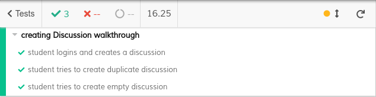
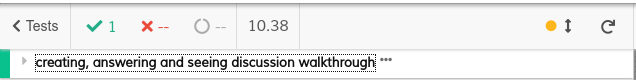
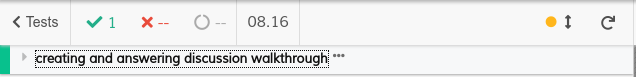

## Feature DDP

### Subgroup

 - José Gomes, ist189490, josemiguelpg
   + Issues assigned: [#192](https://github.com/tecnico-softeng/es20al_14-project/issues/192), [#194](https://github.com/tecnico-softeng/es20al_14-project/issues/194), [#206](https://github.com/tecnico-softeng/es20al_14-project/issues/206), [#207](https://github.com/tecnico-softeng/es20al_14-project/issues/207), [#208](https://github.com/tecnico-softeng/es20al_14-project/issues/208), [#244](https://github.com/tecnico-softeng/es20al_14-project/issues/244) 
 - Telmo Lopes, ist189540, TheZeNinja
   + Issues assigned: [#202](https://github.com/tecnico-softeng/es20al_14-project/issues/202), [#203](https://github.com/tecnico-softeng/es20al_14-project/issues/203), [#204](https://github.com/tecnico-softeng/es20al_14-project/issues/204)
 
### Pull requests associated with this feature

The list of pull requests associated with this feature is:

 - [PR #255](https://github.com/tecnico-softeng/es20al_14-project/pull/255)

### Frontend

#### New/Updated Views

 - [StudentDiscussionsView](https://github.com/tecnico-softeng/es20al_14-project/blob/b66377c5e0dc9bf9d92eed10276e9b001ed674d3/frontend/src/views/student/discussion/StudentDiscussionsView.vue)
 - [DiscussionsView](https://github.com/tecnico-softeng/es20al_14-project/blob/b66377c5e0dc9bf9d92eed10276e9b001ed674d3/frontend/src/views/teacher/discussions/DiscussionsView.vue)
 - [CreateDiscussionDialog](https://github.com/tecnico-softeng/es20al_14-project/blob/b66377c5e0dc9bf9d92eed10276e9b001ed674d3/frontend/src/views/student/discussion/CreateDiscussionDialog.vue)
 - [SeeDiscussionDialog](https://github.com/tecnico-softeng/es20al_14-project/blob/b66377c5e0dc9bf9d92eed10276e9b001ed674d3/frontend/src/views/student/discussion/SeeDiscussionDialog.vue)
 - [AnswerDiscussionDialog](https://github.com/tecnico-softeng/es20al_14-project/blob/b66377c5e0dc9bf9d92eed10276e9b001ed674d3/frontend/src/views/teacher/discussions/AnswerDiscussionDialog.vue)
 - [ResultComponent](https://github.com/tecnico-softeng/es20al_14-project/blob/b66377c5e0dc9bf9d92eed10276e9b001ed674d3/frontend/src/views/student/quiz/ResultComponent.vue)
 
#### New/Updated Models

 - [Discussion](https://github.com/tecnico-softeng/es20al_14-project/blob/b66377c5e0dc9bf9d92eed10276e9b001ed674d3/frontend/src/models/management/Discussion.ts)
 - [StatementAnswer](https://github.com/tecnico-softeng/es20al_14-project/blob/b66377c5e0dc9bf9d92eed10276e9b001ed674d3/frontend/src/models/statement/StatementAnswer.ts)
 - [StatementQuestion](https://github.com/tecnico-softeng/es20al_14-project/blob/b66377c5e0dc9bf9d92eed10276e9b001ed674d3/frontend/src/models/statement/StatementQuestion.ts)

### Additional services implemented

 - [GetDiscussionTeacher](https://github.com/tecnico-softeng/es20al_14-project/blob/b66377c5e0dc9bf9d92eed10276e9b001ed674d3/backend/src/main/java/pt/ulisboa/tecnico/socialsoftware/tutor/discussion/DiscussionService.java#L133)
    + [Controller](https://github.com/tecnico-softeng/es20al_14-project/blob/b66377c5e0dc9bf9d92eed10276e9b001ed674d3/backend/src/main/java/pt/ulisboa/tecnico/socialsoftware/tutor/discussion/DiscussionController.java#L51)
    + [Spock tests](https://github.com/tecnico-softeng/es20al_14-project/blob/b66377c5e0dc9bf9d92eed10276e9b001ed674d3/backend/src/test/groovy/pt/ulisboa/tecnico/socialsoftware/tutor/discussion/service/TeacherSeesStudentRequestsServiceSpockTest.groovy)
    + [Feature test (JMeter)](https://github.com/tecnico-softeng/es20al_14-project/blob/b66377c5e0dc9bf9d92eed10276e9b001ed674d3/backend/jmeter/discussion/WSGetTeacherDiscussions.jmx)

### End-to-end tests

To run these tests firstly you need to copy the file `cypress.env.json.example` and rename it to `cypress.env.json` and then you need to change the values inside this file to the ones of your database. 

`Note: User needs to have a password in the database in order to work properly`

#### Created tests

 
- Create:
  - [Student logins and creates a discussion](https://github.com/tecnico-softeng/es20al_14-project/blob/b66377c5e0dc9bf9d92eed10276e9b001ed674d3/frontend/tests/e2e/specs/discussion/createDiscussion.js#L18)
  - [Student tries to create duplicate discussion](https://github.com/tecnico-softeng/es20al_14-project/blob/b66377c5e0dc9bf9d92eed10276e9b001ed674d3/frontend/tests/e2e/specs/discussion/createDiscussion.js#L23)
  - [Student tries to create empty discussion](https://github.com/tecnico-softeng/es20al_14-project/blob/b66377c5e0dc9bf9d92eed10276e9b001ed674d3/frontend/tests/e2e/specs/discussion/createDiscussion.js#L33)
- Teacher Answer:
  - [Student logins, creates a discussion, teacher logins and answer discussion](https://github.com/tecnico-softeng/es20al_14-project/blob/b66377c5e0dc9bf9d92eed10276e9b001ed674d3/frontend/tests/e2e/specs/discussion/teacherAnswerDiscussion.js#L15)
- Student Sees Answer:
  - [Student logins, creates a discussion, teacher logins, answer discussion, student logins and sees discussion](https://github.com/tecnico-softeng/es20al_14-project/blob/b66377c5e0dc9bf9d92eed10276e9b001ed674d3/frontend/tests/e2e/specs/discussion/studentSeeDiscussions.js#L15)
 
#### Rationale
The defined end-to-end tests show the dependency from the new views, where a student needs to create a request about a certain quiz question and the necessity of the teacher answer about this request so it appears in the student discussiow view. Since this is the common case of this new views group, we decided to create tests about this same aspect.

#### Commands defined

 - [commands.js (group shared)](https://github.com/tecnico-softeng/es20al_14-project/blob/b66377c5e0dc9bf9d92eed10276e9b001ed674d3/frontend/tests/e2e/support/commands.js)
 - [database.js (group shared)](https://github.com/tecnico-softeng/es20al_14-project/blob/b66377c5e0dc9bf9d92eed10276e9b001ed674d3/frontend/tests/e2e/support/database.js)
 - [discussionCommands.js](https://github.com/tecnico-softeng/es20al_14-project/blob/b66377c5e0dc9bf9d92eed10276e9b001ed674d3/frontend/tests/e2e/support/discussion/discussionCommands.js)
 
##### DB Queries
 - [deleteDiscussionSubmission](https://github.com/tecnico-softeng/es20al_14-project/blob/DdP/frontend/tests/e2e/support/discussion/deleteDiscussionSubmission.sql)

#### Screenshot of test results overview

