# ES20 P4 submission, Group 14

## Feature PPA

### Subgroup

- João Miguel Do Ó Matos Soares, 89475, gh-jsoares

  + Issues assigned: [#270](https://github.com/tecnico-softeng/es20al_14-project/issues/270), [#271](https://github.com/tecnico-softeng/es20al_14-project/issues/271), [#272](https://github.com/tecnico-softeng/es20al_14-project/issues/272), [#273](https://github.com/tecnico-softeng/es20al_14-project/issues/273), [#274](https://github.com/tecnico-softeng/es20al_14-project/issues/274), [#292](https://github.com/tecnico-softeng/es20al_14-project/issues/292), [#293](https://github.com/tecnico-softeng/es20al_14-project/issues/293), [#294](https://github.com/tecnico-softeng/es20al_14-project/issues/294), [#295](https://github.com/tecnico-softeng/es20al_14-project/issues/295), [#296](https://github.com/tecnico-softeng/es20al_14-project/issues/296), [#299](https://github.com/tecnico-softeng/es20al_14-project/issues/299), [#300](https://github.com/tecnico-softeng/es20al_14-project/issues/300), [#343](https://github.com/tecnico-softeng/es20al_14-project/issues/343), [#344](https://github.com/tecnico-softeng/es20al_14-project/issues/344), [#345](https://github.com/tecnico-softeng/es20al_14-project/issues/345), [#346](https://github.com/tecnico-softeng/es20al_14-project/issues/346), [#347](https://github.com/tecnico-softeng/es20al_14-project/issues/347), [#348](https://github.com/tecnico-softeng/es20al_14-project/issues/348), [#349](https://github.com/tecnico-softeng/es20al_14-project/issues/349), [#350](https://github.com/tecnico-softeng/es20al_14-project/issues/350), [#366](https://github.com/tecnico-softeng/es20al_14-project/issues/366), [#367](https://github.com/tecnico-softeng/es20al_14-project/issues/367), [#368](https://github.com/tecnico-softeng/es20al_14-project/issues/368), [#369](https://github.com/tecnico-softeng/es20al_14-project/issues/369), [#370](https://github.com/tecnico-softeng/es20al_14-project/issues/370), [#371](https://github.com/tecnico-softeng/es20al_14-project/issues/371), [#372](https://github.com/tecnico-softeng/es20al_14-project/issues/372), [#373](https://github.com/tecnico-softeng/es20al_14-project/issues/373), [#375](https://github.com/tecnico-softeng/es20al_14-project/issues/375), [#376](https://github.com/tecnico-softeng/es20al_14-project/issues/376), [#377](https://github.com/tecnico-softeng/es20al_14-project/issues/377), [#378](https://github.com/tecnico-softeng/es20al_14-project/issues/378), [#379](https://github.com/tecnico-softeng/es20al_14-project/issues/379), [#380](https://github.com/tecnico-softeng/es20al_14-project/issues/380), [#381](https://github.com/tecnico-softeng/es20al_14-project/issues/381), [#382](https://github.com/tecnico-softeng/es20al_14-project/issues/382)

- Luís António Lopes Cardoso, 89493, LuisAntonioCardoso

  + Issues assigned:

### Pull requests associated with this feature

The list of pull requests associated with this feature is:

 - [PR #001](https://github.com/tecnico-softeng/es20al_14-project/pull/291)

### Listed features

Below, we list **only** the implemented features. For each feature, we link the relevant files and we mark which are requested parts are completed.

#### Feature number 4: _Uma questão aprovada pode passar a fazer parte do conjunto de perguntas disponíveis_

 - [x] [Service](https://github.com/tecnico-softeng/es20al_14-project/blob/PpA-P4/backend/src/main/java/pt/ulisboa/tecnico/socialsoftware/tutor/question/StudentQuestionService.java#L176)
 - [x] [Spock tests](https://github.com/tecnico-softeng/es20al_14-project/blob/PpA-P4/backend/src/test/groovy/pt/ulisboa/tecnico/socialsoftware/tutor/question/service/studentquestions/ConvertApprovedStudentQuestionToQuestionSpockTest.groovy)
     
 - [x] [Controller](https://github.com/tecnico-softeng/es20al_14-project/blob/PpA-P4/backend/src/main/java/pt/ulisboa/tecnico/socialsoftware/tutor/question/api/StudentQuestionController.java#L100)
 - [x] [JMeter feature tests](https://github.com/tecnico-softeng/es20al_14-project/blob/PpA-P4/backend/jmeter/studentquestion/WSApproveStudentQuestionAsTeacherTest.jmx)
   + Screenshots:
      
     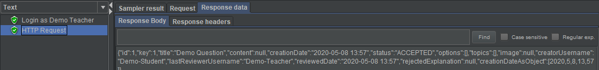
     
 - [x] [Cypress use case test](https://github.com/tecnico-softeng/es20al_14-project/blob/PpA-P4/frontend/tests/e2e/specs/questions/student/approveStudentQuestion.js)
   + Screenshot: 
   
     
     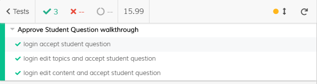

#### Feature number 5: _Um docente pode alterar uma pergunta aprovada antes de a colocar como fazendo parte do conjunto de perguntas disponíveis_

 - [x] [Service](https://github.com/tecnico-softeng/es20al_14-project/blob/PpA-P4/backend/src/main/java/pt/ulisboa/tecnico/socialsoftware/tutor/question/StudentQuestionService.java#L176)
 - [x] [Spock tests](https://github.com/tecnico-softeng/es20al_14-project/blob/PpA-P4/backend/src/test/groovy/pt/ulisboa/tecnico/socialsoftware/tutor/question/service/studentquestions/TeacherEditStudentQuestionBeforeApprovalSpockTest.groovy)
     
 - [x] [Controller](https://github.com/tecnico-softeng/es20al_14-project/blob/PpA-P4/backend/src/main/java/pt/ulisboa/tecnico/socialsoftware/tutor/question/api/StudentQuestionController.java#L100)
 - [x] [JMeter feature tests](https://github.com/tecnico-softeng/es20al_14-project/blob/PpA-P4/backend/jmeter/studentquestion/WSEditBeforeApproveStudentQuestionAsTeacherTest.jmx)
   + Screenshots:
      
     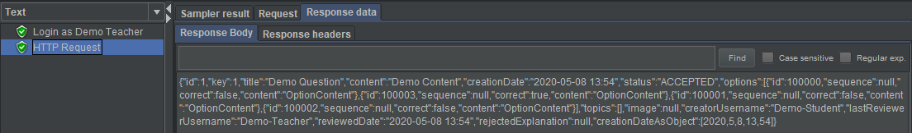
     
 - [x] [Cypress use case test](https://github.com/tecnico-softeng/es20al_14-project/blob/PpA-P4/frontend/tests/e2e/specs/questions/student/approveStudentQuestion.js)
   + Screenshot: 
   
     
     

#### Feature number 6: _Uma pergunta rejeitada pode ser alterada e resubmetida pelo aluno_

 - [x] [Service](https://github.com/tecnico-softeng/es20al_14-project/blob/PpA-P4/backend/src/main/java/pt/ulisboa/tecnico/socialsoftware/tutor/question/StudentQuestionService.java#L162)
 - [x] [Spock tests](https://github.com/tecnico-softeng/es20al_14-project/blob/PpA-P4/backend/src/test/groovy/pt/ulisboa/tecnico/socialsoftware/tutor/question/service/studentquestions/ConvertApprovedStudentQuestionToQuestionSpockTest.groovy)
     
 - [x] [Controller](https://github.com/tecnico-softeng/es20al_14-project/blob/PpA-P4/backend/src/main/java/pt/ulisboa/tecnico/socialsoftware/tutor/question/api/StudentQuestionController.java#L124)
 - [x] [JMeter feature tests](https://github.com/tecnico-softeng/es20al_14-project/blob/PpA-P4/backend/jmeter/studentquestion/WSEditRejectedStudentQuestionAsStudentTest.jmx)
   + Screenshots:
      
     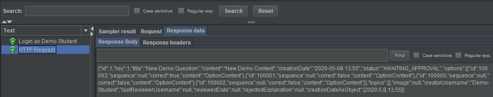
     
 - [x] [Cypress use case test](https://github.com/tecnico-softeng/es20al_14-project/blob/PpA-P4/frontend/tests/e2e/specs/questions/student/editStudentQuestion.js)
   + Screenshot: 
   
     
     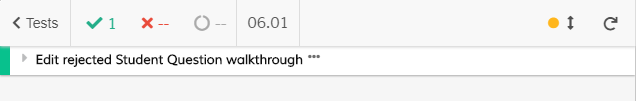

#### Feature number 7: _Existe um _dashboard_ do aluno onde é apresentada informação acerca do seu número de perguntas propostas e aprovadas_

 - [x] [Service](https://github.com/tecnico-softeng/es20al_14-project/blob/PpA-P4/backend/src/main/java/pt/ulisboa/tecnico/socialsoftware/tutor/dashboard/DashboardService.java)
 - [x] [Spock tests](https://github.com/tecnico-softeng/es20al_14-project/blob/PpA-P4/backend/src/test/groovy/pt/ulisboa/tecnico/socialsoftware/tutor/question/service/studentquestions/ConvertApprovedStudentQuestionToQuestionSpockTest.groovy)
     
 - [x] [Controller](https://github.com/tecnico-softeng/es20al_14-project/blob/PpA-P4/backend/src/main/java/pt/ulisboa/tecnico/socialsoftware/tutor/dashboard/DashboardController.java)
 - [x] [JMeter feature test 1](https://github.com/tecnico-softeng/es20al_14-project/blob/PpA-P4/backend/jmeter/dashboard/WSGetStudentQuestionStats.jmx)
   + Screenshots:
      
     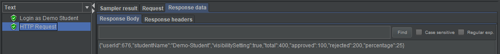
     
 - [x] [JMeter feature test 2](https://github.com/tecnico-softeng/es20al_14-project/blob/PpA-P4/backend/jmeter/dashboard/WSGetUserStudentQuestionStats.jmx)
   + Screenshots:
      
     
     
 - [x] [Cypress use case test](https://github.com/tecnico-softeng/es20al_14-project/blob/PpA-P4/frontend/tests/e2e/specs/dashboard/studentQuestionsDashboard.js)
   + Screenshot: 
     
     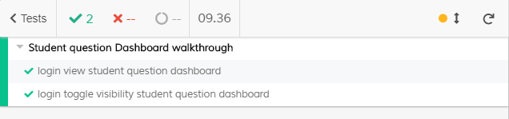

#### Feature number 8: _O aluno decide se esta informação no seu _dashboard_ deve ser pública ou privada_

 - [x] [Service](https://github.com/tecnico-softeng/es20al_14-project/blob/PpA-P4/backend/src/main/java/pt/ulisboa/tecnico/socialsoftware/tutor/dashboard/DashboardService.java)
 - [x] [Spock tests](https://github.com/tecnico-softeng/es20al_14-project/blob/PpA-P4/backend/src/test/groovy/pt/ulisboa/tecnico/socialsoftware/tutor/question/service/studentquestions/ConvertApprovedStudentQuestionToQuestionSpockTest.groovy)
     
 - [x] [Controller](https://github.com/tecnico-softeng/es20al_14-project/blob/PpA-P4/backend/src/main/java/pt/ulisboa/tecnico/socialsoftware/tutor/dashboard/DashboardController.java)
 - [x] [JMeter feature test](https://github.com/tecnico-softeng/es20al_14-project/blob/PpA-P4/backend/jmeter/dashboard/WSToggleStudentQuestionStatsVisibility.jmx)
   + Screenshots:
      
     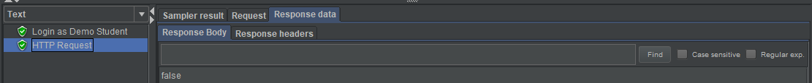
     
 - [x] [Cypress use case test](https://github.com/tecnico-softeng/es20al_14-project/blob/PpA-P4/frontend/tests/e2e/specs/dashboard/studentQuestionsDashboard.js)
   + Screenshot: 
   
     
     

### Additional features
No new additional features

---

## Feature TDP

### Subgroup

 - Alexandre Duarte, 89403, alexduarte23
   + Issues assigned: [#268](https://github.com/tecnico-softeng/es20al_14-project/issues/268), [#301](https://github.com/tecnico-softeng/es20al_14-project/issues/301),
   [#306](https://github.com/tecnico-softeng/es20al_14-project/issues/306), [#320](https://github.com/tecnico-softeng/es20al_14-project/issues/320),
   [#326](https://github.com/tecnico-softeng/es20al_14-project/issues/326), [#327](https://github.com/tecnico-softeng/es20al_14-project/issues/327),
   [#337](https://github.com/tecnico-softeng/es20al_14-project/issues/337), [#339](https://github.com/tecnico-softeng/es20al_14-project/issues/339),
   [#354](https://github.com/tecnico-softeng/es20al_14-project/issues/354), [#355](https://github.com/tecnico-softeng/es20al_14-project/issues/355), 
   [#385](https://github.com/tecnico-softeng/es20al_14-project/issues/385), [#387](https://github.com/tecnico-softeng/es20al_14-project/issues/387)
   + Tasks: F5:Service, F5:Spock Tests, F5: Refactoring, F7:Service, F7:Spock Tests, F7: web service, F7:Feature Test, F7: web page, F7: e2e tests
 - Daniel Lopes, 89426, DFL13
   + Issues assigned: [#261](https://github.com/tecnico-softeng/es20al_14-project/issues/261), [#262](https://github.com/tecnico-softeng/es20al_14-project/issues/262),
   [#263](https://github.com/tecnico-softeng/es20al_14-project/issues/263), [#264](https://github.com/tecnico-softeng/es20al_14-project/issues/264),
   [#265](https://github.com/tecnico-softeng/es20al_14-project/issues/265), [#266](https://github.com/tecnico-softeng/es20al_14-project/issues/266),
   [#267](https://github.com/tecnico-softeng/es20al_14-project/issues/267), [#269](https://github.com/tecnico-softeng/es20al_14-project/issues/269),
   [#303](https://github.com/tecnico-softeng/es20al_14-project/issues/303), [#305](https://github.com/tecnico-softeng/es20al_14-project/issues/305),
   [#312](https://github.com/tecnico-softeng/es20al_14-project/issues/312), [#319](https://github.com/tecnico-softeng/es20al_14-project/issues/319),
   [#324](https://github.com/tecnico-softeng/es20al_14-project/issues/324), [#329](https://github.com/tecnico-softeng/es20al_14-project/issues/329),
   [#340](https://github.com/tecnico-softeng/es20al_14-project/issues/340), [#341](https://github.com/tecnico-softeng/es20al_14-project/issues/341),
   [#342](https://github.com/tecnico-softeng/es20al_14-project/issues/342), [#356](https://github.com/tecnico-softeng/es20al_14-project/issues/356),
   [#357](https://github.com/tecnico-softeng/es20al_14-project/issues/357), [#358](https://github.com/tecnico-softeng/es20al_14-project/issues/358), 
   [#386](https://github.com/tecnico-softeng/es20al_14-project/issues/386)
   
   + Tasks: F4:Service, F4:Spock Tests, F4: Refactoring, F4: web service, F4:Feature Test, F4: web page, F4: e2e tests, F6:Service, F6:Spock Tests, F6: Feature Test, F6: web page, F6: e2e tests,
   F8:Service, F8:Spock Tests, F8: web service, F8:Feature Test, F8: web page, F8: e2e tests
 
### Pull requests associated with this feature

The list of pull requests associated with this feature is:

 - [PR #000](https://github.com/tecnico-softeng/es20al_14-project/pull/390)

### Listed features

Below, we list **only** the implemented features. For each feature, we link the relevant files and we mark which are requested parts are completed.

#### Feature number 4: _O aluno que criou o torneio pode cancelá-lo_

 - [x] [Service](https://github.com)
 - [x] [Spock tests](https://github.com)
 - [x] [JMeter feature tests](https://github.com)
   + Screenshots:
      
     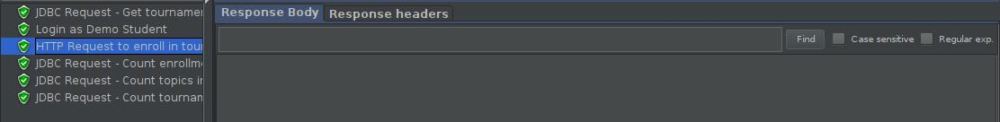
     
 - [x] [Cypress use case test](https://github.com)
   + Screenshot: 
   
     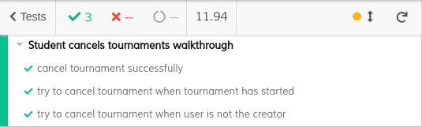

#### Feature number 5: _Se o número de alunos inscritos, incluindo o criador do torneio, for superior a 1, o sistema gera o quiz associado ao torneio_

 - [x] [Service](https://github.com)
 - [x] [Spock tests](https://github.com)
 - [ ] [JMeter feature test](https://github.com)
 - [ ] [Cypress use case test](https://github.com)

#### Feature number 6: _Os alunos participantes respondem às perguntas no período definido para o torneio_

 - [x] [Service](https://github.com)
 - [x] [Spock tests](https://github.com) (minor changes to getOpenTournaments test)
 - [X] [JMeter feature test](https://github.com)
    + Screenshots:
       
      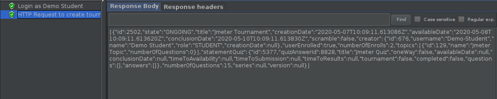
 - [X] [Cypress use case test](https://github.com)
    + Screenshot: 
    
      

#### Feature number 7: _Existe um dashboard do aluno onde é apresentada informação acerca dos torneios em que participou e qual a sua pontuação_

 - [x] [Service](https://github.com)
 - [x] [Spock tests](https://github.com)
 - [X] [JMeter feature test](https://github.com)
    + Screenshots:
       
      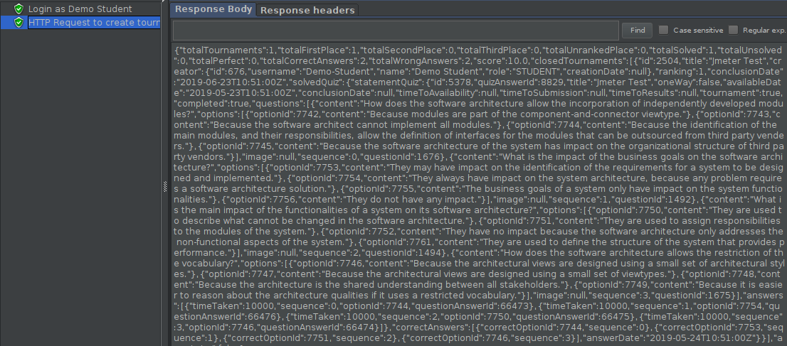
 - [X] [Cypress use case test](https://github.com)
    + Screenshot: 
    
      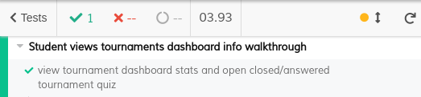

#### Feature number 8: _O aluno decide se esta informação no seu dashboard deve ser pública ou privada_

 - [x] [Service](https://github.com)
 - [x] [Spock tests](https://github.com)
 - [X] [JMeter feature test](https://github.com)
    + Screenshots:
       
      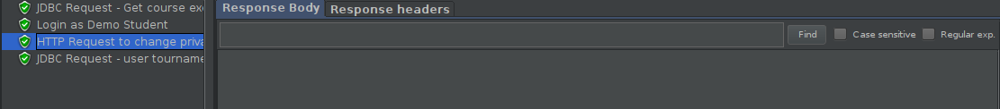
 - [X] [Cypress use case test](https://github.com)
    + Screenshot: 
    
      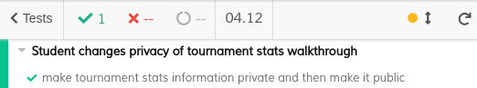

### Additional features

---