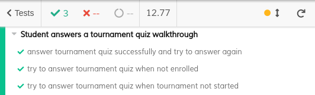

# ES20 P4 submission, Group 14

## Feature TDP

### Subgroup

 - Alexandre Duarte, 89403, alexduarte23
   + Issues assigned: [#268](https://github.com/tecnico-softeng/es20al_14-project/issues/268), [#301](https://github.com/tecnico-softeng/es20al_14-project/issues/301),
   [#306](https://github.com/tecnico-softeng/es20al_14-project/issues/306), [#320](https://github.com/tecnico-softeng/es20al_14-project/issues/320),
   [#326](https://github.com/tecnico-softeng/es20al_14-project/issues/326), [#327](https://github.com/tecnico-softeng/es20al_14-project/issues/327),
   [#337](https://github.com/tecnico-softeng/es20al_14-project/issues/337), [#339](https://github.com/tecnico-softeng/es20al_14-project/issues/339),
   [#354](https://github.com/tecnico-softeng/es20al_14-project/issues/354), [#355](https://github.com/tecnico-softeng/es20al_14-project/issues/355), 
   [#385](https://github.com/tecnico-softeng/es20al_14-project/issues/385), [#387](https://github.com/tecnico-softeng/es20al_14-project/issues/387)
   + Tasks: F5:Service, F5:Spock Tests, F5: Refactoring, F7:Service, F7:Spock Tests, F7: web service, F7:Functionality Test, F7: web page, F7: e2e tests
 - Daniel Lopes, 89426, DFL13
   + Issues assigned: [#261](https://github.com/tecnico-softeng/es20al_14-project/issues/261), [#262](https://github.com/tecnico-softeng/es20al_14-project/issues/262),
   [#263](https://github.com/tecnico-softeng/es20al_14-project/issues/263), [#264](https://github.com/tecnico-softeng/es20al_14-project/issues/264),
   [#265](https://github.com/tecnico-softeng/es20al_14-project/issues/265), [#266](https://github.com/tecnico-softeng/es20al_14-project/issues/266),
   [#267](https://github.com/tecnico-softeng/es20al_14-project/issues/267), [#269](https://github.com/tecnico-softeng/es20al_14-project/issues/269),
   [#303](https://github.com/tecnico-softeng/es20al_14-project/issues/303), [#305](https://github.com/tecnico-softeng/es20al_14-project/issues/305),
   [#312](https://github.com/tecnico-softeng/es20al_14-project/issues/312), [#319](https://github.com/tecnico-softeng/es20al_14-project/issues/319),
   [#324](https://github.com/tecnico-softeng/es20al_14-project/issues/324), [#329](https://github.com/tecnico-softeng/es20al_14-project/issues/329),
   [#340](https://github.com/tecnico-softeng/es20al_14-project/issues/340), [#341](https://github.com/tecnico-softeng/es20al_14-project/issues/341),
   [#342](https://github.com/tecnico-softeng/es20al_14-project/issues/342), [#356](https://github.com/tecnico-softeng/es20al_14-project/issues/356),
   [#357](https://github.com/tecnico-softeng/es20al_14-project/issues/357), [#358](https://github.com/tecnico-softeng/es20al_14-project/issues/358), 
   [#386](https://github.com/tecnico-softeng/es20al_14-project/issues/386)
   
   + Tasks: F4:Service, F4:Spock Tests, F4: Refactoring, F4: web service, F4:Functionality Test, F4: web page, F4: e2e tests, F6:Service, F6:Spock Tests, F6: web service, F6: web page, F6: e2e tests,
   F8:Service, F8:Spock Tests, F8: web service, F8:Functionality Test, F8: web page, F8: e2e tests
 
### Pull requests associated with this feature

The list of pull requests associated with this feature is:

 - [PR #000](https://github.com)

### Listed features

Below, we list **only** the implemented features. For each feature, we link the relevant files and we mark which are requested parts are completed.

#### Feature number 4: _O aluno que criou o torneio pode cancelá-lo_

 - [x] [Service](https://github.com)
 - [x] [Spock tests](https://github.com)
 - [x] [JMeter feature tests](https://github.com)
   + Screenshots:
      
     
     
 - [x] [Cypress use case test](https://github.com)
   + Screenshot: 
   
     

#### Feature number 5: _Se o número de alunos inscritos, incluindo o criador do torneio, for superior a 1, o sistema gera o quiz associado ao torneio_

 - [x] [Service](https://github.com)
 - [x] [Spock tests](https://github.com)
 - [ ] [JMeter feature test](https://github.com)
 - [ ] [Cypress use case test](https://github.com)

#### Feature number 6: _Os alunos participantes respondem às perguntas no período definido para o torneio_

 - [x] [Service](https://github.com)
 - [x] [Spock tests](https://github.com)
 - [X] [JMeter feature test](https://github.com)
    + Screenshots:
       
      
 - [X] [Cypress use case test](https://github.com)
    + Screenshot: 
    
      

#### Feature number 7: _Existe um dashboard do aluno onde é apresentada informação acerca dos torneios em que participou e qual a sua pontuação_

 - [x] [Service](https://github.com)
 - [x] [Spock tests](https://github.com)
 - [X] [JMeter feature test](https://github.com)
    + Screenshots:
       
      
 - [X] [Cypress use case test](https://github.com)
    + Screenshot: 
    
      

#### Feature number 8: _O aluno decide se esta informação no seu dashboard deve ser pública ou privada_

 - [x] [Service](https://github.com)
 - [x] [Spock tests](https://github.com)
 - [X] [JMeter feature test](https://github.com)
    + Screenshots:
       
      
 - [X] [Cypress use case test](https://github.com)
    + Screenshot: 
    
      

### Additional features

**TODO**: if you have implemented additional features, describe them here (following the same format as above).

---